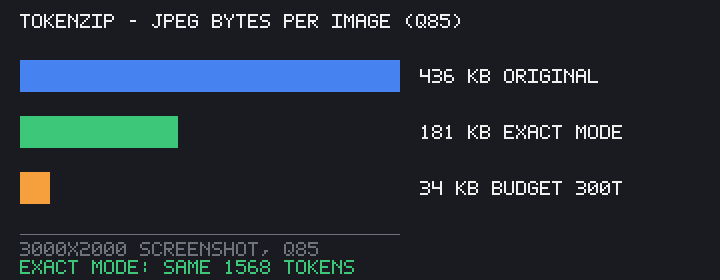

# tokenzip



Vision models count image tokens by *tiles*, not megapixels. A 3000×2000
screenshot costs Claude exactly the same 1568 tokens whether you upload 6
megapixels or the 1328×885 it internally resizes to. tokenzip computes that
exact size per provider and re-encodes the image: same tokens, same detail
the model ever sees, far fewer bytes uploaded.

```
$ tokenzip screenshot.png --provider anthropic

screenshot.png — 3000×2000 (Claude (Anthropic))
  billed tokens : 1568 ≈ $0.0047/image
  model sees    : 1328×885
  pixels to send: 19.6% (80% fewer bytes)
  note          : send 1328×885: identical tokens & detail, 80% fewer bytes
```

## Install / run

```bash
npm install @asynx6/tokenzip          # CLI: npx tokenzip, lib: require('@asynx6/tokenzip')
npm install -g @asynx6/tokenzip       # global `tokenzip` command
# or no install at all (zero deps): clone + `node tokenzip.js ...`
```

## Hook it into your AI tools

**Claude Code — never burn 1568 tokens on a bloated Read again.** The hook
intercepts image Reads, rewrites oversized files into a tokenzip cache, and
Claude sees the resized copy:

```bash
claude --settings '{"hooks":{"PreToolUse":[{"matcher":"Read","hooks":[{"type":"command","command":"npx -y @asynx6/tokenzip hook claude-code"}]}]}}'
```

Or add the same block permanently to `.claude/settings.json`. PNG and
baseline JPEG inputs only; anything weird passes through untouched.

**Claude Desktop / OpenCode / Cursor / anything that speaks MCP:**

```json
{ "mcpServers": { "tokenzip": { "command": "npx", "args": ["-y", "@asynx6/tokenzip", "mcp"] } } }
```

OpenCode uses the same JSON under `mcp` in its config (`type: "local"`).
Tools exposed: `tokenzip_estimate`, `tokenzip_optimize` (writes a file and
tells you exact token/byte deltas), `tokenzip_batch_dir`.

**As a library:**

```js
import { PROVIDERS, anthropicTokens } from '@asynx6/tokenzip';
import { optimize } from '@asynx6/tokenzip/optimize';

anthropicTokens(3000, 2000);              // 1568 — what one shot costs
const plan = optimize('anthropic', 3000, 2000);
// plan.best = { w: 1328, h: 885, tokens: 1568 }  — resize to this, bill unchanged
```

CLI, hook, MCP, and library share the same tested formulas — no drift
between "what the tool says" and "what your code does".

## What it does

- **Per-provider token math** for Claude, GPT-4o+, and Gemini — the resize +
  tile formulas from each provider's own docs, pinned with tests (512²→255
  tokens, 768²→787, 2×768→258, etc.). Formula sources and dates are recorded
  in [FORMULAS.md](FORMULAS.md).
- **Exact mode**: shrink to the size the provider's own pipeline ends up at.
  Token bill unchanged, upload bytes slashed (matters for latency, egress
  fees, mobile, batch agents that resend images every turn).
- **Budget mode** (`--max-tokens 300`): binary-searches the largest resize
  that fits your cap, and tells you how many tokens it saves per image.
- **Re-encode** (`--out`): writes the optimized image. PNG (built-in
  zero-dep encoder, 8-bit) and JPEG (baseline DCT encode; decode accepts
  baseline JPEG input) — no external binaries.
- **Folder mode** (`--dir ./shots`): per-image analysis across a directory.

## Why this saves anything

The money saving is a myth worth killing honestly: tiles are billed on the
provider's *post-resize* dimensions, so resizing first costs you zero
tokens saved on a single image. What you actually save:

1. Upload bandwidth and time — a screenshot batch of 500 images at 80%
   fewer bytes is a real bill on egress-priced storage and a real wall-clock
   cut for agents.
2. Budget mode is where money moves: an agent that sends 1105-token tiles
   per screenshot but only needs layout understanding can cap at 300 and
   cut its vision bill ~70%, with the tool finding the sharpest image that
   fits.
3. Knowing the floor: images under ~768px are one tile on every provider —
   making screenshots small *is* the optimization, and `tokenzip` shows the
   exact per-provider breakpoints.

## Benchmarks

`node bench.mjs` regenerates this table in-memory (reproducible, no
network, no fixtures):

| input (JPEG q85) | size | Anthropic tok | exact→ bytes | budget 300 tok→ |
|---|---|---|---|---|
| screenshot-like | 3000×2000 | 1568 | 1328×885 · 436 KB → 181 KB (−58%) | 512×341 · 34 KB (−805 tok) |
| chat UI | 1280×800 | 1366 | already optimal · 19 KB → 19 KB | 512×320 (−1105 tok) |
| phone shot | 1080×2400 | 1568 | 727×1616 · 306 KB → 243 KB (−21%) | 230×512 (−1190 tok) |

The chat-UI row is the honest counter-example: an image already near the
provider floor gains nothing — and tokenzip tells you that instead of
shrinking something pointlessly.

## Limitations (read before trusting)

- JPEG: baseline encode/decode (4:4:4 + 4:2:0, quality knob). Progressive
  and lossless JPEG inputs throw a clear error instead of guessing. WebP
  has no codec in v0.x — convert or help us build it.
- 8-bit PNGs, non-interlaced.
- Token formulas match provider docs as of 2026-09; they have changed
  before. [FORMULAS.md](FORMULAS.md) pins sources, dates, and the update
  procedure; `test-tokens.js` fails loudly when docs and code diverge.
- Cost figures are order-of-magnitude list-price estimates. Your rate plan
  differs.
- Budget mode optimizes pixels-per-token, not task quality. Only you know
  whether 300 tokens still reads your chart. Check the resized output.

## Tests

```bash
node test-tokens.js   # 12 provider-math cases against documented examples
node test-png.js      # codec roundtrips, palette, resize, optimize invariants
node test-jpeg.js     # JPEG encode→decode roundtrip vs own decoder + System.Drawing check
node bench.mjs        # regenerates the README benchmark table
```

## Contributing

Start with [CONTRIBUTING.md](CONTRIBUTING.md) — it explains the codec
architecture in one page.

## License

MIT
